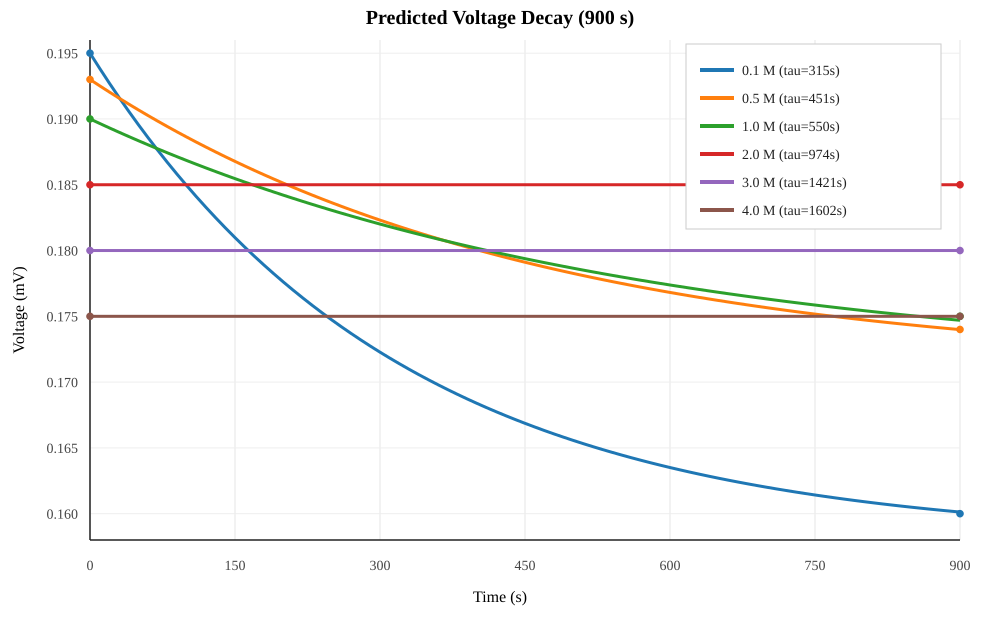

# Salt Bridge Voltage Decay Prediction (900 s)

## Model

- Two-segment approximation + first-order relaxation: `V(t) = V_inf + (V0 - V_inf) * exp(-t/tau)`.
- `tau(c)` is scaled using bridge diffusivity trend from `bridge_metrics_estimated.csv` (higher concentration -> lower D -> larger tau).
- Total duration fixed to `900 s` (same as experiment).

## Figure

Source data:
- `voltage_decay_prediction_curve_900s.csv`
- `voltage_decay_prediction_timepoints_900s.csv`

## Key Results

| Conc (M) | D_eff (1e-10 m2/s) | tau (s) | V(0s) mV | V(300s) mV | V(600s) mV | V(900s) mV |
|---:|---:|---:|---:|---:|---:|---:|
| 0.1 | 11.598 | 315.0 | 0.195 | 0.1723 | 0.1635 | 0.160 |
| 0.5 | 4.163 | 450.9 | 0.193 | 0.1823 | 0.1768 | 0.174 |
| 1.0 | 2.364 | 549.9 | 0.190 | 0.1820 | 0.1774 | 0.175 |
| 2.0 | 0.461 | 973.8 | 0.185 | 0.1850 | 0.1850 | 0.185 |
| 3.0 | 0.157 | 1421.1 | 0.180 | 0.1800 | 0.1800 | 0.180 |
| 4.0 | 0.111 | 1602.0 | 0.175 | 0.1750 | 0.1750 | 0.175 |

## Interpretation vs Experiment

- Low concentration (`0.1M`, `0.5M`, `1.0M`) shows clear decay within 900 s.
- High concentration (`2.0M`, `3.0M`, `4.0M`) is nearly flat in 900 s.
- This is consistent with the transport trend: higher concentration has much lower `D`, so concentration-gradient relaxation is slower and voltage is more stable.

## Notes

- This is a minimal predictive model for trend interpretation, not a full electrochemical transient solver.
- Absolute voltage matching may still require activity correction and explicit interfacial transient terms.

## Theory (Short)

- 液接电势（LJP）来自不同电解液接触后，阳/阴离子扩散速度不等造成的瞬时电荷分离与反向电场。
- 本报告用了两个工程化近似。
1. 静态端点项（两段近似）：`Delta_phi ~ (RT/F)*(1-2*t_plus)*ln(a2/a1)`，分别算 `ref->bridge` 和 `bridge->test` 后相加。
2. 瞬态衰减项（一阶弛豫）：`V(t)=V_inf + (V0-V_inf)*exp(-t/tau)`，并令 `tau` 随扩散系数降低而变大（高浓更稳）。
- 因此可解释实验现象：低浓度桥（D大）在 900 s 内明显掉压；高浓度桥（D小）在同一时间窗近似平台。

## References

- IUPAC Gold Book: Liquid Junction definition (L03584): https://old.goldbook.iupac.org/html/L/L03584.html
- Perram, J. W. *Electrochimica Acta* 2006, 51(25), 5274-5279. DOI: https://doi.org/10.1016/j.electacta.2006.02.032
- Bard, A. J.; Faulkner, L. R. *Electrochemical Methods: Fundamentals and Applications* (2nd ed., Wiley, 2001). (Section: Liquid Junction Potentials / Henderson equation)
- Stewart, S. G.; Newman, J. *J. Electrochem. Soc.* 2008, 155(6), A458-A463. DOI: https://doi.org/10.1149/1.2904526
- Li, T. et al. *JACS Au* 2022, 2(12), 2709-2726. DOI: https://doi.org/10.1021/jacsau.2c00590
